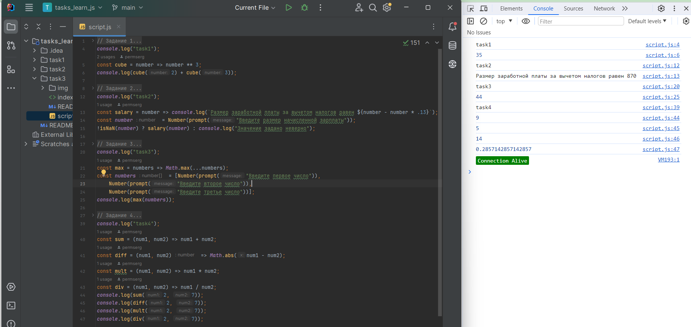

## Урок 6. Семинар. Знакомство с функциями в JavaScript

### Задание 1
Создайте функцию которая возводит переданное число в куб, необходимо вывести в консоль результат 2^3 степени + 3 ^ 3 степени

### Задание 2
Пользователь вводит с клавиатуры число, если ввёл текст, необходимо вывести что значение задано неверно
Создать фукнцию, которая высчитывает 13% от данного числа и выводит в консоль текст "Размер заработной платы за вычетом налогов равен значение"

### Задание 3
Пользователь с клавиатуры вводит 3 числа, необходимо создать функцию, которая определяет максимальное значение среди этих чисел

### Задание 4
Необходимо реализовать четыре функции, каждая функция должна принимать по два числа и выполнять одну из операций (каждая функция выполняет одну из них):
1. Сложение
2. Разность
3. Умножение
4. Деление

Необходимо сделать так, чтобы функция вернула число, например выражение console.log(sum(2, 6)); должно вывести число 8 в консоль (sum - функция сложения в данном примере, ваши названия функций могут отличаться). Округлять значения, которые возвращают функции не нужно, однако, обратите внимание на разность, функция должна вычесть из большего числа меньшее, либо вернуть 0, если числа равны. Функциям всегда передаются корректные числа, проверки на NaN, Infinity делать не нужно.

### Решение
